# Saarthi — National Welfare Intelligence System

> **Formal Research Title:** *NWIS: A Knowledge Graph-Based National Welfare Intelligence System for Citizen-Centric Governance and Policy Decision Support*

[](#test-suite--verification)
[](#data--welfare-scheme-model)
[](#multilingual-support)
[](#authentication--security)

Saarthi is a citizen-centric welfare intelligence platform designed to help Indian citizens discover, understand, verify eligibility for, prepare documents for, and track applications across central and state welfare programmes. The platform bridges the deep information asymmetry between complex statutory gazette notifications and eligible citizens by converting fragmented public welfare rules into structured, explainable, and actionable intelligence.

At a macro level, the **National Welfare Intelligence System (NWIS)** represents the dual-sided research architecture connecting citizen-level discovery and application telemetry with government-side analytics, district delivery saturation mapping, gap analysis, and policy simulation.

> **Core Philosophy:** *AI assists; verified rule engine decides.*
> Generative AI is deliberately restricted to assistive guidance, procedural clarity, and multilingual natural-language interaction. Legal eligibility decisions and entitlement evaluations are executed exclusively by a deterministic Abstract Syntax Tree (AST) rule engine operating on 3-valued Kleene logic.

---

## Table of Contents

1. [Project Status](#project-status)
2. [The Problem](#the-problem)
3. [The Saarthi Solution](#the-saarthi-solution)
4. [Core Design Principle](#core-design-principle)
5. [Key Features](#key-features)
   - [Citizen Portal](#citizen-portal)
   - [Government Welfare Intelligence Console](#government-welfare-intelligence-console)
   - [Operations & Scheme Registry](#operations--scheme-registry)
6. [Search & Discovery Architecture](#search--discovery-architecture)
7. [Multilingual Support](#multilingual-support)
8. [Authentication & Security Architecture](#authentication--security-architecture)
9. [System Architecture](#system-architecture)
10. [Technology Stack](#technology-stack)
11. [Repository Structure](#repository-structure)
12. [Data & Welfare Scheme Model](#data--welfare-scheme-model)
13. [Eligibility Engine & Decision Science](#eligibility-engine--decision-science)
14. [AI & Gemini Integration](#ai--gemini-integration)
15. [Setup & Installation](#setup--installation)
16. [Environment Variables](#environment-variables)
17. [Database & Supabase Configuration](#database--supabase-configuration)
18. [Running the Application](#running-the-application)
19. [User Roles & Access Control](#user-roles--access-control)
20. [Current Implementation Status](#current-implementation-status)
21. [Limitations & Important Notes](#limitations--important-notes)
22. [Roadmap](#roadmap)
23. [Research & Academic Context](#research--academic-context)
24. [Contributing](#contributing)
25. [Security Policy](#security-policy)
26. [License](#license)
27. [Acknowledgements](#acknowledgements)

---

## Project Status

The repository contains an **actively developed, full-stack implementation (v2.0.0)** consisting of a React single-page application, Supabase PostgreSQL backend with Row Level Security (RLS), Supabase Edge Functions, and a suite of 91 automated regression tests.

- **Scheme Coverage:** The repository includes a canonical registry of **268 real Central and State Government welfare schemes** (`src/api/schemesData.js` and `src/api/extendedSchemes.js`). Every scheme contains structured metadata, AST eligibility rules, required document lists, and official government portal URLs.
- **Rule Verification & Provenance:** Schemes feature provenance metadata including rule versioning (`rule_version`), effective gazette dates (`rule_effective_from`), nodal ministries/departments, and official verification status.
- **Simulation vs. Production Data Clarification:** District-level aggregates in the Government Intelligence Console (such as the 47.3 Cr national eligible population metric, 2,147 active scheme baseline, and district delivery saturation curves across sample districts) are powered by a **deterministic synthetic population model (`SyntheticPopulationAPI`)**. They represent simulation and demonstration capabilities for policy intelligence, not live production telemetry from all 700+ Indian district collectorates.

---

## The Problem

Public welfare programmes in India represent hundreds of thousands of crores in budgetary outlays annually. However, statutory welfare delivery suffers from severe structural fragmentation across ministries, departments, state jurisdictions, and external portals.

### The Citizen Discovery Challenge
Citizens frequently encounter friction at every stage of the welfare journey:
- **Fragmentation:** Information is scattered across hundreds of nodal websites (e.g., PM-KISAN, National Scholarship Portal, state revenue portals).
- **Ambiguous Eligibility:** Official notifications use complex bureaucratic language with multiple concurrent criteria (land ceilings, caste categories, income caps, demographic thresholds). Citizens struggle to answer: *"Do I qualify, and if not, why?"*
- **The Missing-Data Trap:** Most conventional search portals fail silently or miscalculate when an applicant does not know an exact parameter (e.g., treating blank income as ₹0 or issuing false rejections).
- **Document Uncertainty:** Welfare schemes require specific statutory proofs issued by varying competent authorities (Tehsildar, Gram Panchayat, UIDAI, Banks). Citizens often discover missing documents only after traveling to physical offices.
- **Application Routing:** After discovering a scheme, citizens do not know where to apply, what the direct portal URL is, or how to track progress.

### The Governance & Policy Challenge
From the administrative perspective, policymakers and district officers lack unified, real-time intelligence:
- Welfare coverage data is locked in departmental silos with limited cross-scheme visibility.
- District collectors lack automated telemetry on why eligible citizens drop out (e.g., document blockers vs. portal abandonment).
- Policymakers cannot easily simulate the budgetary or demographic impact of adjusting scheme eligibility thresholds (e.g., raising an income ceiling from ₹1.5L to ₹2.5L).

---

## The Saarthi Solution

Saarthi bridges this divide by formalizing welfare criteria into structured knowledge graphs and deterministic logic rules, providing two interconnected portals:

### 1. Citizen Welfare Flow
```
Citizen Demographic Profile / Passport
               │
               ▼
Welfare Knowledge Layer (268 Schemes + Gazette Rules)
               │
               ▼
Deterministic AST Rule Engine (3-Valued Kleene Logic)
               │
               ▼
Explainable Decision Trace + SHA-256 Decision ID
               │
               ▼
Status-Aware Document Readiness Evaluation (Vault)
               │
               ▼
Personalized Action Plan & Outbound Portal Routing
               │
               ▼
Application Submission & Lifecycle Tracking
```

### 2. Government Welfare Intelligence Flow
```
Aggregated Applications & Demographic Data
               │
               ▼
District Welfare Intelligence & Saturation Mapping
               │
               ▼
Welfare Gap Analysis & Primary Blocker Diagnostics
               │
               ▼
Policy Lab: Threshold Adjustment & Scenario Simulation
               │
               ▼
Auditable Welfare Telemetry & Integrity Reports
```

---

## Core Design Principle

### AI Assists; Verified Rule Engine Decides

The cardinal architectural rule of Saarthi is that **Generative AI must never be the authoritative decision-maker for welfare eligibility**.

| Dimension | Deterministic AST Rule Engine (Saarthi Core) | Large Language Models / Generative AI |
| :--- | :--- | :--- |
| **Role in Saarthi** | **Authoritative Decision Maker** | **Assistive & Language Interface** |
| **Execution** | Boolean AST predicate evaluation on normalized profile attributes | Natural-language query translation and conversational guidance |
| **Auditability** | 100% reproducible; produces byte-for-byte SHA-256 decision digests | Non-deterministic; probabilistic output |
| **Missing Data** | 3-valued Kleene logic (`passed`, `failed`, `insufficient_data`) | Prone to hallucinations, false assumptions, or default-zero biases |
| **Legal Provenance** | Tied to explicit gazette rule versions and statutory conditions | Cannot cite statutory authority reliably without hallucinations |

- **Authoritative Rules:** All eligibility determinations, match percentages, and near-miss classifications are computed by the deterministic engine in `src/engine/eligibilityEngine.js`.
- **Assistive AI:** Google Gemini 1.5 Flash (interfaced through a serverless edge proxy) provides plain-language explanations, conversational document guidance, and query understanding. Gemini is explicitly instructed via system prompts that it does not hold authority to grant, deny, or alter eligibility decisions.
- **Traceability:** Every evaluation emits an immutable Decision Reference ID (`DEC-<SCHEME>-<HASH>`), allowing any decision to be audited against the citizen profile and scheme rule version active at evaluation time.

---

## Key Features

### Citizen Portal
Accessible at `/citizen/*` (requires authenticated `citizen` role or interactive demo persona session).

- **Citizen Onboarding & Profile (`/citizen/onboarding`, `/citizen/profile`):** Comprehensive demographic capture covering age, gender, occupation, annual income, domicile state, district, social category, land holding, housing type, BPL ration card status, and disability attributes.
- **Household Graph (`/citizen/household`):** Models multi-generational family units. Enables calculation of aggregate household income (required for scholarship and housing schemes) distinct from individual applicant income.
- **Schemes Catalogue & Explorer (`/citizen/explorer`):** Searchable catalogue across 268 schemes with state filters, category filters, and real-time eligibility evaluation badges.
- **Natural Language Intent Search:** Parses complex citizen queries (e.g., *"I am a 20yo SC student in Rajasthan earning 1.8 lakh"*) into structured parameters while preserving keyword fallback matching.
- **Explainable Scheme Detail (`/citizen/scheme/:id`):** Displays comprehensive scheme breakdowns, including direct benefit quantum, processing timeline, nodal ministry, issuing authority, and a condition-by-condition boolean decision trace explaining why the user passed, failed, or requires more data.
- **Smart Recommendations (`/citizen/recommendations`):** Ranks schemes into high-confidence matches, near-misses, and missing-information tiers.
- **Scheme Comparison Matrix (`/citizen/compare`):** Side-by-side comparison of benefits, eligibility criteria, and required proofs across up to 3 selected programmes.
- **Document Vault (`/citizen/documents`):** Status-aware locker tracking document verification stages (`verified`, `under_review`, `uploaded`, `expiring_soon`, `expired`, `rejected`). Computes document readiness percentages for target schemes.
- **Action Plan (`/citizen/action-plan`):** Generates a step-by-step roadmap guiding citizens on which documents to resolve first to unlock blocked welfare schemes.
- **Application Hub & Tracker (`/citizen/applications`):** Tracks application lifecycles (`submitted`, `under_review`, `approved`, `disbursed`, `rejected`) with official reference numbers conforming to the `SAARTHI-2026-XXXXXX` format.
- **Ask Saarthi AI Assistant (`/citizen/assistant` & slide-out drawer):** Conversational assistant powered by Gemini 1.5 Flash via Edge Function, offering grounded guidance on document procurement and scheme rules.
- **Notifications Hub (`/citizen/notifications`):** Proactive alerts for document expirations, newly eligible schemes, and application milestone updates.
- **Multilingual Switcher:** Instant UI translation across 11 Indian languages.

### Government Welfare Intelligence Console
Accessible at `/government/*` (requires authenticated `government` or `admin` role).

- **Executive Welfare Dashboard (`/government/dashboard`):** High-level view of entitled population metrics, active scheme coverage, aggregate budget utilization, and recent live application intake.
- **District Intelligence (`/government/districts`):** Multi-state geographic telemetry breaking down coverage rates, reached populations, and unreached gaps across districts (e.g., Surat, Anand, Varanasi, Jodhpur, Gwalior, Kozhikode).
- **3D Topographic Elevation Map:** CSS 3D visualization illustrating welfare delivery saturation across states.
- **Welfare Gap Analysis (`/government/gap-analysis`):** Identifies primary systemic blockers preventing eligible citizens from receiving benefits (documentation deficits, portal bounce rates, awareness gaps).
- **Policy Lab & Simulation (`/government/policy-lab`):** Interactive sandbox allowing administrators to adjust income thresholds, age brackets, or land criteria and instantly view projected demographic impact and budget variance.
- **Scheme Performance Tracker (`/government/performance`):** Analytics on processing duration, approval velocity, and scheme popularity.
- **Risk & Integrity Visualizer (`/government/fraud`):** Anomaly indicators flagging suspicious duplicate patterns or document inconsistencies.
- **Reports & Audits (`/government/reports`, `/government/audit`):** Downloadable executive summaries and tamper-evident audit trails.

### Operations & Scheme Registry
Accessible at `/operations/*` (requires authenticated `admin` role).

- **Operations Dashboard (`/operations/dashboard`):** System vitals, active scheme counts, pending verifications, and user role metrics.
- **Scheme Registry Manager (`/operations/registry`):** Central database of all ingested schemes with lifecycle tracking (`DISCOVERED`, `EXTRACTED`, `UNDER_REVIEW`, `VERIFIED`, `PUBLISHED`, `EXPIRED`).
- **Scheme Ingestion Wizard (`/operations/add-scheme`):** Admin tool to register new programmes, define AST eligibility condition trees, and assign required documents.
- **Rule Versioning & Audit History (`/operations/scheme/:id`):** Semver tracking (`v1.0`, `v1.1`) of gazette rule amendments with mandatory change notes and historic immutability.
- **Verification Queue (`/operations/verification`):** Workflow for human operators to inspect scraped or ingested schemes against official gazette notifications before publishing.
- **User Role Management (`/operations/users`):** View and manage role assignments (`citizen`, `government`, `admin`).
- **Audit Logs (`/operations/audit-logs`):** Append-only audit trail logging administrative actions, privilege elevations, and verification updates.
- **System Health (`/operations/system-health`):** Latency telemetry, database connection health, and storage utilization.

---

## Search & Discovery Architecture

Saarthi implements a multi-tier search engine designed to handle both exact administrative lookups and unstructured citizen language:

```
Citizen Search Query
         │
         ├─── Length Check (> 4 characters)
         │           │
         │           ▼
         │   [Natural Language Intent Parser]
         │   Extracts: Age, Income, Occupation, Category, BPL, State
         │           │
         │           ├── Meaningful structured attributes found?
         │           │       ├── YES ──► Dynamically synthesizes Active Evaluation Context
         │           │       └── NO  ──► Maintains Citizen Profile Context
         │           │
         │           ▼
         ├─── [Structured State Filter] (All-India + Selected State)
         ├─── [Structured Category Filter] (Agriculture, Education, etc.)
         │           │
         │           ▼
         └─── [Textual Keyword Matching]
             Strictly enforces keyword presence across title, code, 
             ministry, and description when no structured intent is detected
```

- **Separation of Concerns:** Ordinary keyword searches (e.g., *"scholarship"*, *"pension"*) remain active without being suppressed by the intent parser. Structured intent filtering activates only when verifiable demographic attributes (e.g., *"farmer earning 1.5 lakh"*) are explicitly detected.
- **Safe Regex Tokenization:** Category extraction enforces word-boundary safety (e.g., `/\b(sc|scheduled\s+caste)\b/i`), preventing substring collisions where the word *"scheme"* would falsely trigger the Scheduled Caste (*SC*) filter.
- **State Domicile Scope:** Queries seamlessly isolate schemes applicable to the citizen's state while preserving all Central Government (*All-India*) schemes.

---

## Multilingual Support

Saarthi includes a built-in localization engine (`src/context/LanguageContext.jsx`) supporting **11 major Indian languages**:

| Language Code | Language | Native Name | Status |
| :---: | :---: | :---: | :---: |
| `en` | English | English | Source / Reference |
| `hi` | Hindi | हिन्दी | Fully Supported |
| `gu` | Gujarati | ગુજરાતી | Fully Supported |
| `mr` | Marathi | मराठी | Fully Supported |
| `bn` | Bengali | বাংলা | Fully Supported |
| `te` | Telugu | తెలుగు | Fully Supported |
| `ta` | Tamil | தமிழ் | Fully Supported |
| `kn` | Kannada | ಕನ್ನಡ | Fully Supported |
| `ml` | Malayalam | മലയാളം | Fully Supported |
| `pa` | Punjabi | ਪੰਜਾਬੀ | Fully Supported |
| `or` | Odia | ଓଡ଼ିଆ | Fully Supported |

### Architectural Distinction: UI Localization vs. Legal Translations
- **UI Localization:** All navigation bars, category tags, eligibility status badges, buttons, form placeholders, and core workflow labels are translated and cached locally. If a specific translation key is absent in a target language, the engine falls back gracefully to English:
  ```javascript
  t(key) => translations[currentLang]?.[key] || translations['en']?.[key] || key
  ```
- **Authoritative Scheme Content:** Official gazette scheme names, statutory rule definitions, and official portal links remain in their canonical administrative formats (predominantly English and official gazette Hindi) to prevent legal distortion through machine translation.

---

## Authentication & Security Architecture

Saarthi enforces security at the protocol, database, and application layers:

### 1. Authentication & Role-Based Access Control (RBAC)
- Powered by **Supabase Auth** supporting Email/Password authentication and Google OAuth 2.0.
- User accounts are mapped to authoritative database roles in the `user_roles` table:
  - `citizen`: Can manage own profile, household, documents, and submit applications.
  - `government`: Can view aggregated telemetry, district intelligence, audit records, and inspect applications.
  - `admin`: Can modify scheme registry records, manage user roles, and inspect system audit logs.
- **Strict Fail-Closed Invariant:** The client application never self-assigns or fabricates roles. If a database query fails or a user record possesses no role in `user_roles`, role resolution returns `null` and the user is redirected to the login interface.

### 2. PostgreSQL Row Level Security (RLS)
Every table in the database is protected by PostgreSQL Row Level Security:
- `profiles` & `household_members`: Citizens can only query and mutate records where `id = auth.uid()` or `profile_id = auth.uid()`.
- `schemes`: Public read access for active schemes; write access restricted to admins.
- `applications` & `documents`: Citizens can only access records matching their `auth.uid()`. Government officials have read access for verification purposes.
- **Recursion-Free Security Definer Functions:** Admin and government checks are encapsulated in a secure schema (`private.is_admin()`, `private.is_government()`) with clean `search_path = ''` to prevent infinite RLS recursion and search_path hijacking.

### 3. Database Privilege Lockdown Triggers
PostgreSQL database triggers enforce business-layer integrity:
- **No Citizen Self-Verification:** The `trg_check_document_privileges` trigger strictly prevents citizens from modifying document statuses to `verified` or tampering with `verified_at` timestamps.
- **No Citizen Application Self-Approval:** The `trg_check_application_privileges` trigger strictly prevents citizens from transitioning application states to `approved` or `disbursed`.
- **Application Idempotency:** A database-level unique constraint (`idx_applications_profile_scheme_unique`) prevents a citizen from submitting duplicate concurrent applications for the same scheme.

### 4. Storage Security
- Document uploads (identity cards, land records, passbooks) are stored in a private Supabase Storage bucket (`documents`).
- Storage RLS rules restrict upload and read operations to the owner's isolated folder path:
  ```sql
  (storage.foldername(name))[1] = auth.uid()::text
  ```
- Government officials and administrators can inspect uploaded files for verification, but cross-citizen access is strictly blocked.

### 5. Server-Enforced Audit Logging
- System audit events are emitted through a secure PostgreSQL stored procedure (`log_audit_event`).
- Standard citizens cannot emit privileged audit events (e.g., `APPROVE_APPLICATION`, `CHANGE_USER_ROLE`). The `audit_logs` table is append-only; update and delete operations are rejected for all roles.

---

## System Architecture

The following diagram illustrates the component architecture and data flows across Saarthi and NWIS:

```mermaid
flowchart TB
    subgraph ClientLayer [Client Application - React 18 / Vite]
        CitizenUI[Citizen Portal\n/citizen/*]
        GovUI[Government Console\n/government/*]
        OpsUI[Operations Manager\n/operations/*]
        
        subgraph ClientEngine [Local Intelligence & State Engine]
            ASTEngine[Deterministic AST\nEligibility Engine]
            KGModule[Welfare Knowledge\nGraph Builder]
            AuthCtx[Auth & RBAC Context\nFail-Closed Invariant]
            LangCtx[Language Context\n11 Indian Languages]
        end
    end

    subgraph EdgeLayer [Supabase Edge Network / Deno Runtime]
        EdgeAsk[ask-saarthi\nEdge Function]
        EdgeEval[evaluate-eligibility\nEdge Function]
    end

    subgraph AIService [External AI Intelligence]
        Gemini[Google Gemini 1.5 Flash\nAssistive Guidance Only]
    end

    subgraph DataPlatform [Supabase Platform / PostgreSQL Cluster]
        SupaAuth[Supabase Auth\nJWT / OAuth]
        
        subgraph PostgresDB [PostgreSQL with Row Level Security]
            T_Profiles[(profiles)]
            T_Household[(household_members)]
            T_Schemes[(schemes / scheme_registry)]
            T_Applications[(applications)]
            T_Docs[(documents)]
            T_Roles[(user_roles)]
            T_Audit[(audit_logs)]
            
            DBTriggers[Triggers & Private Schema\nField Lockdown & Anti-Recursion]
        end
        
        SupaStorage[(Supabase Storage\nPrivate 'documents' Bucket)]
    end

    %% Client Interactions
    CitizenUI --> AuthCtx
    CitizenUI --> ASTEngine
    CitizenUI --> KGModule
    CitizenUI --> LangCtx
    GovUI --> AuthCtx
    OpsUI --> AuthCtx

    %% Auth & Data Flow
    AuthCtx --> SupaAuth
    ClientEngine --> PostgresDB
    ClientEngine --> SupaStorage

    %% Edge & AI Flow
    CitizenUI -- User Assistance Query --> EdgeAsk
    EdgeAsk -- Authenticates JWT --> SupaAuth
    EdgeAsk -- Grounded Assistive Prompt --> Gemini
    GovUI -. RPC Simulation .-> EdgeEval

    %% Database Internal Links
    DBTriggers --- PostgresDB
```



---

## Technology Stack

The repository utilizes the following production technologies verified directly from `package.json` and the source tree:

| Layer | Technology | Version | Purpose in Saarthi |
| :--- | :--- | :--- | :--- |
| **Frontend Framework** | React | `^18.3.1` | Core declarative component architecture |
| **DOM Engine** | React DOM | `^18.3.1` | Web document object model rendering |
| **Routing** | React Router DOM | `^6.29.0` | Client-side routing, protected routes, and layouts |
| **Build & Dev Server**| Vite | `^6.1.1` | Ultra-fast ES-module bundler and dev environment |
| **Styling & Design** | Vanilla CSS + Tokens | Native CSS | Custom design token system (`tokens.css`, `base.css`) |
| **Icons** | Lucide React | `^0.475.0` | Accessible SVG iconography |
| **Backend / BaaS** | Supabase | `^2.49.1` | PostgreSQL database, Auth, Storage, and Edge Functions |
| **Database** | PostgreSQL | 15+ | Relational data store with Row Level Security (RLS) |
| **Serverless Runtime**| Deno (Supabase Edge) | Native | Edge runtime hosting secure AI and evaluation proxies |
| **AI / LLM** | Google Gemini 1.5 Flash | v1beta API | Plain-language advisory assistant (`ask-saarthi`) |
| **Visual Effects** | CSS 3D Perspective | Native CSS | Physical Ledger tilt and Topographic Map visualization |
| **Telemetry / Web** | @vercel/analytics | `^2.0.1` | Real-time web vitals and client analytics |
| **Test Runner** | Node.js Test Harness | Node 20+ | Standalone ES-module test suite (91 assertions) |

---

## Repository Structure

```
.
├── .env.example                     # Environment template for frontend configuration
├── DEPLOYMENT.md                    # Runbook for Vercel, Supabase, and Edge deployment
├── index.html                       # HTML5 entrypoint with Google Fonts typography
├── package.json                     # Project manifest, scripts, and dependencies
├── vite.config.js                   # Vite configuration
├── migration.sql                    # Core database schema (profiles, applications, schemes)
├── rbac_migration.sql               # Role-based access control and signup bootstrap trigger
├── registry_migration.sql           # Scheme registry, versioning, sources, and verification
├── security_integrity_migration.sql # Private schema, RLS anti-recursion, and audit triggers
│
├── docs/                            # Capstone documentation and defense guides
│   ├── REVIEW_III_PRESENTATION_DECK.md
│   ├── USER_EVALUATION_PROTOCOL.md
│   └── VIVA_DEFENSE_CHEATSHEET.md
│
├── scripts/                         # Build, test, and catalog generation utilities
│   ├── test-engine.js               # 91-test regression suite for AST engine & security
│   ├── build_200_schemes.py         # Python catalog builder
│   ├── generate_extended_schemes.js # Scheme synthesizer
│   └── catalog_*.py                 # Domain-specific scheme catalogs (agriculture, health, etc.)
│
├── supabase/                        # Backend Edge Functions
│   └── functions/
│       ├── ask-saarthi/             # Gemini 1.5 Flash server-side proxy
│       └── evaluate-eligibility/    # Edge-side AST evaluation handler
│
└── src/                             # Application source code
    ├── main.jsx                     # Application bootstrap and root rendering
    ├── App.jsx                      # Route definitions and layout nesting
    │
    ├── api/                         # Data layer and backend clients
    │   ├── supabaseClient.js        # Supabase JavaScript client initialization
    │   ├── schemesData.js           # 268-scheme master registry and localStorage fallback
    │   ├── extendedSchemes.js       # Curated Central & State scheme definitions
    │   ├── geminiApi.js             # Client interface to ask-saarthi Edge Function
    │   ├── applicationsApi.js       # Application submission and tracking API
    │   ├── documentsApi.js          # Document vault and upload management API
    │   ├── govAnalyticsApi.js       # Government console aggregation layer
    │   ├── registryApi.js           # Operations registry management API
    │   └── syntheticPopulationApi.js# Deterministic demo population simulation engine
    │
    ├── components/                  # Reusable UI components
    │   ├── 3d/                      # CSS 3D components (ExtrudedMap3D, HeroLedger3D)
    │   ├── common/                  # Modals, drawers, language selector, protected routes
    │   └── layout/                  # Layout shells (Citizen, Government, Operations, Public)
    │
    ├── context/                     # Global state providers
    │   ├── AuthContext.jsx          # Auth state, RBAC, profiles, applications, and demo personas
    │   ├── LanguageContext.jsx      # 11-language localization dictionary and provider
    │   └── SchemeContext.jsx        # Scheme catalogue caching and filtering context
    │
    ├── engine/                      # Core decision science algorithms
    │   ├── eligibilityEngine.js     # AST Evaluator, 3-valued logic, and SHA-256 decision IDs
    │   └── knowledgeGraph.js        # Entity-relationship graph (Citizen, Schemes, Documents)
    │
    ├── pages/                       # Application view controllers
    │   ├── citizen/                 # 16 citizen-facing views (Dashboard, Explorer, etc.)
    │   ├── government/              # 10 government intelligence views (Districts, PolicyLab)
    │   ├── operations/              # 10 administrative operations views (Registry, Users)
    │   └── landing/                 # Public landing page, Beta guide, Privacy, Terms
    │
    └── styles/                      # Design system
        ├── tokens.css               # Color variables, typography tokens, elevation scales
        ├── base.css                 # Reset, typography, and utility classes
        ├── components.css           # Buttons, cards, badges, modal styling
        └── citizen.css / government.css / operations.css / landing.css
```

---

## Data & Welfare Scheme Model

Every scheme in Saarthi is structured according to a canonical 17-dimension data model (`src/api/schemesData.js`):

```typescript
interface CanonicalScheme {
  id: string;                           // Unique identifier
  scheme_code: string;                  // Official acronym/code (e.g., "PM-KISAN")
  official_name: string;                // Full gazette title
  short_name: string;                   // Concise display name
  ministry: string;                     // Union or State Ministry
  department: string;                   // Nodal Department
  government_level: 'central' | 'state' | 'joint';
  state: string;                        // "All-India" or specific State/UT
  category: string;                     // e.g., "agriculture", "education", "social_security"
  beneficiary_types: string[];          // e.g., ["farmer", "rural", "landowner"]
  description: string;                  // Statutory scope and objective
  benefits: {
    summary: string;                    // Human-readable entitlement
    quantum: string;                    // Financial or in-kind value
    mode: string;                       // e.g., "DBT", "Cashless Hospitalization"
    frequency: string;                  // e.g., "Annual / 3 Tranches"
    ceiling?: string;
  };
  processing_days: number;              // Standard citizen service charter duration
  ast_rules: ASTRuleGroup;              // Abstract Syntax Tree boolean eligibility rules
  exclusions: string[];                 // Statutory disqualifiers (e.g., Income Tax payees)
  documents: string[];                  // Required proofs list
  structured_documents: {               // Document requirements with authority metadata
    name: string;
    mandatory: boolean;
    issuing_authority: string;
    digilocker_supported: boolean;
  }[];
  application_process: {                // Step-by-step workflow guidance
    mode: string;
    steps: string[];
  };
  official_url: string;                 // Authoritative government portal endpoint
  rule_version: string;                 // Semver identifier (e.g., "v1.0")
  last_verified_at: string;             // ISO-8601 timestamp of last gazette verification
}
```

### Central vs. State Scheme Handling
Schemes marked with `state: "All-India"` or `government_level: "central"` are universally evaluated for all eligible citizens regardless of domicile. Schemes tied to specific states (e.g., *Mukhyamantri Amrutam* in Gujarat, *Chiranjeevi* in Rajasthan) are evaluated exclusively for citizens whose verified state of residence matches the scheme's target territory.

---

## Eligibility Engine & Decision Science

The eligibility engine (`src/engine/eligibilityEngine.js`) evaluates citizen demographic attributes against scheme conditions deterministically.

### 1. AST Predicate Operators
The engine evaluates leaf conditions using 10 strongly-typed comparison operators:
- `EQ` / `NEQ`: Strict equality / inequality (e.g., `gender == "female"`).
- `GT` / `GTE`: Numeric greater than / greater than or equal (e.g., `age >= 60`).
- `LT` / `LTE`: Numeric less than / less than or equal (e.g., `income_annual <= 250000`).
- `IN` / `NOT_IN`: Array inclusion / exclusion (e.g., `category IN ["sc", "st"]`).
- `CONTAINS`: Case-insensitive substring matching.
- `BETWEEN`: Closed numerical range verification `[min, max]`.

### 2. 3-Valued Kleene Logic (Null & Missing Data Safety)
Unlike naive rule evaluators that treat undefined attributes as `0` or `false`, Saarthi implements **3-valued Kleene logic**:
- **`passed`**: The citizen attribute satisfies the statutory condition.
- **`failed`**: The citizen attribute explicitly violates the statutory condition.
- **`insufficient_data`**: The citizen has not provided the required attribute.

```
Kleene Logic Evaluation Matrix:
AND Combinator:
  passed            AND passed            = passed
  passed            AND insufficient_data = insufficient_data
  failed            AND insufficient_data = failed (short-circuit failure)
  insufficient_data AND insufficient_data = insufficient_data

OR Combinator:
  passed            OR failed             = passed
  failed            OR insufficient_data  = insufficient_data
```

This prevents the **Missing-Data Trap**: an applicant with an unentered income is not falsely rejected for a low-income scheme; instead, they receive an `insufficient_data` state that guides them to provide the missing field.

### 3. Household Graph Income Aggregation
The engine dynamically traverses the household graph:
```javascript
household.aggregate_income = profile.income_annual + sum(members.income_annual)
```
- Schemes evaluating individual income (e.g., *PM-KISAN*) evaluate against `citizen.income_annual`.
- Schemes evaluating household means (e.g., *Post-Matric Scholarships*, *PMAY Housing*) evaluate against `household.aggregate_income`.
- Explicit ₹0 income is preserved as numeric `0`, while completely unreported income resolves to `undefined`.

### 4. Near-Miss & Tolerance Detection
If an applicant fails a single non-critical criterion within a defined margin (e.g., annual income is within ₹10,000 of a ₹2.5L ceiling, or age is 1 year below a threshold), the engine classifies the scheme as **`nearly_eligible`** and annotates the exact numerical delta in the decision trace.

### 5. Deterministic Decision Reference ID
Every evaluation generates a deterministic, cryptographically digest-backed decision reference ID using a pure synchronous SHA-256 implementation:
```
DEC-<SCHEME_TAG>-<12_CHAR_SHA256_HEX>
Example: DEC-PMKISAN-4A9B118C02F5
```
- Given identical profile attributes, household structure, scheme criteria, and rule versions, the engine produces **byte-for-byte identical decision reference IDs**.
- Any amendment in citizen income, age, domicile, or scheme rule version immediately produces a divergent decision ID, ensuring strict auditability.

---

## AI & Gemini Integration

Saarthi incorporates Google Gemini 1.5 Flash via a serverless Supabase Edge Function (`supabase/functions/ask-saarthi/index.ts`).

### Grounded Assistive Guidance
When a citizen interacts with **Ask Saarthi**:
1. The client sends the natural-language question alongside the citizen's demographic context, list of matched scheme names, and missing document requirements.
2. The Edge Function verifies the caller's JWT token via Supabase Auth.
3. The server-side proxy transmits the request to Gemini using a strict system instruction:
   > *"You are Saarthi, an assistive welfare intelligence guide for India... STRICT OPERATIONAL RULES: You DO NOT determine legal eligibility. The deterministic AST Rule Engine has already evaluated the citizen's profile. Never override or contradict the engine results. If a citizen is missing documents, explain where to obtain them. Do not invent benefits or relaxed criteria."*
4. The Gemini response is returned with grounded provenance metadata (`model: "Gemini 1.5 Flash (Edge Protected)"`, `authority: "Deterministic Rule Engine v2.0"`).

### Deterministic Offline Fallback
If the Gemini API key is unconfigured or the network service is unavailable, `src/api/geminiApi.js` automatically activates a deterministic rule-based response engine. It provides grounded advice regarding verified documents, PM-KISAN rules, and eligibility breakdowns without breaking the user experience.

---

## Setup & Installation

### Prerequisites
- **Node.js:** v18.0.0 or higher (v20+ recommended).
- **npm:** v9.0.0 or higher.
- **Git:** Standard git client.
- **Supabase Account:** Free tier project or local Supabase CLI instance.
- **Google Gemini API Key:** (Optional) Required only if deploying the `ask-saarthi` Edge Function.

### Step-by-Step Installation

1. **Clone the repository:**
   ```bash
   git clone https://github.com/404Vardan/saarthi-welfare-intelligence.git
   cd saarthi-welfare-intelligence
   ```

2. **Install project dependencies:**
   ```bash
   npm install
   ```

3. **Configure Environment Variables:**
   Copy the example environment template to create a local `.env`:
   ```bash
   cp .env.example .env
   ```
   Open `.env` and fill in your Supabase project credentials (see [Environment Variables](#environment-variables)).

4. **Execute Regression Test Suite:**
   Verify the integrity of the AST engine, Kleene logic, and security authorization invariants:
   ```bash
   npm test
   ```
   *Expected output: `91 Passed, 0 Failed` across all test groups.*

5. **Start Local Development Server:**
   ```bash
   npm run dev
   ```
   The application will be accessible at `http://localhost:5173`.

---

## Environment Variables

Create a `.env` file in the root directory:

| Variable | Description | Required | Scope |
| :--- | :--- | :---: | :--- |
| `VITE_SUPABASE_URL` | Your Supabase Project URL (`https://<ref>.supabase.co`) | **Yes** | Client-side frontend |
| `VITE_SUPABASE_ANON_KEY`| Your Supabase public anonymous API key | **Yes** | Client-side frontend |
| `GEMINI_API_KEY` | Google Gemini API Key | Optional | **Server-side only** (Set in Supabase Edge Secrets) |

> [!IMPORTANT]
> Never set `GEMINI_API_KEY` with a `VITE_` prefix in `.env`. In Saarthi, AI keys remain strictly server-side inside Supabase Edge Function secrets and are never exposed to browser bundles.

---

## Database & Supabase Configuration

To configure the Supabase backend, execute the SQL migration files in the **Supabase SQL Editor** in the following exact sequence:

1. **`migration.sql`**: Creates core relational tables (`profiles`, `household_members`, `schemes`, `applications`, `documents`, `notifications`, `saved_schemes`).
2. **`rbac_migration.sql`**: Provisions the `user_roles` table, basic RLS policies, and the `handle_new_user_bootstrap` trigger that auto-creates profiles and assigns the `citizen` role upon email or OAuth signup.
3. **`registry_migration.sql`**: Provisions the startup-grade scheme registry architecture, including `scheme_registry`, `scheme_rule_versions`, `scheme_sources`, and `scheme_change_history`.
4. **`security_integrity_migration.sql`**: Deploys the isolated `private` schema with `is_admin()` and `is_government()` functions, eliminates recursive RLS, activates document/application privilege triggers, configures the private `documents` storage bucket, and secures audit logging.

### Edge Function Deployment
To deploy the Gemini-backed `ask-saarthi` assistant:
```bash
# Log in to Supabase CLI
supabase login

# Link your local project
supabase link --project-ref your-project-ref

# Set the Gemini secret in the cloud vault
supabase secrets set GEMINI_API_KEY=your_actual_gemini_api_key

# Deploy the Edge Function
supabase functions deploy ask-saarthi
```

---

## Running the Application

| Action | Command | Output / Endpoint |
| :--- | :--- | :--- |
| **Start Development Server** | `npm run dev` | Local Vite HMR server at `http://localhost:5173` |
| **Execute Regression Tests** | `npm test` | Headless execution of 91 engine and security tests |
| **Compile Production Bundle**| `npm run build` | Optimized static assets compiled to `dist/` |
| **Preview Production Build** | `npm run preview` | Local preview server serving `dist/` |

---

## User Roles & Access Control

Saarthi defines three distinct operational roles with hard boundaries enforced by both client routing and database RLS:

| Role | Target User | Accessible Surface | Primary Permissions |
| :--- | :--- | :--- | :--- |
| `citizen` | Indian Citizens & Beneficiaries | `/citizen/*` | Create/edit demographic passport, manage household, upload documents, search schemes, submit applications, query Ask Saarthi. |
| `government` | District Collectors, Welfare Officers, Policy Analysts | `/government/*` | Inspect district welfare saturation, evaluate delivery gaps, simulate policy scenarios, review citizen applications. |
| `admin` | Systems Administrators & Registry Operators | `/operations/*` & `/government/*` | Ingest new welfare schemes, author AST rules, bump rule versions, manage user roles, audit system health. |

### Interactive Demo Personas (Zero-Friction Testing)
To enable reviewers and examiners to evaluate the application without manual registration, Saarthi includes 5 statutory test personas accessible from `/citizen/login` or `/beta-guide`:
- **Ramesh Patel (Marginal Farmer):** Surat, Gujarat · Target: PM-KISAN, PMFBY.
- **Pooja Meghwal (SC Student):** Jaipur, Rajasthan · Target: Post-Matric SC Scholarship.
- **Anjali Devi (Mother / Homemaker):** Patna, Bihar · Target: PMMVY, PM Ujjwala.
- **Govind Ram (Artisan / Carpenter):** Varanasi, Uttar Pradesh · Target: PM Vishwakarma.
- **Devaki Amma (BPL Senior Citizen, 68yo):** Kollam, Kerala · Target: IGNOAPS Pension.

---

## Current Implementation Status

| System Domain | Component | Implementation Status | Notes |
| :--- | :--- | :---: | :--- |
| **Citizen Portal** | Demographic Passport | **Implemented** | Full demographic & economic profile capture |
| | Household Graph | **Implemented** | Multi-member aggregation for household income |
| | Scheme Catalogue | **Implemented** | 268 verified Central & State programmes |
| | Natural Language Search| **Implemented** | Structured intent extraction + keyword fallback |
| | Deterministic AST Engine| **Implemented** | 10 operators, 3-valued Kleene logic, tolerance checks |
| | Document Vault | **Implemented** | Status-aware document readiness scoring |
| | Application Hub | **Implemented** | Idempotent lifecycle tracking (`SAARTHI-2026-XXXXXX`) |
| | Multilingual UI | **Implemented** | 11 languages with automatic English fallback |
| | Ask Saarthi Assistant | **Implemented** | Gemini 1.5 Flash via Edge Function with grounded fallback |
| **Government Console**| Welfare Dashboard | **Implemented** | Macro indicators and recent application telemetry |
| | District Intelligence | **Implemented** | District saturation metrics (using synthetic demo models) |
| | Policy Lab | **Implemented** | Real-time threshold adjustment sandbox |
| | Welfare Gap Analysis | **Implemented** | Diagnostic blocker categorization |
| **Operations** | Scheme Registry | **Implemented** | Full lifecycle tracking (`DISCOVERED` to `PUBLISHED`) |
| | Rule Versioning | **Implemented** | Semver tracking of gazette criteria updates |
| | User Role Manager | **Implemented** | RBAC role inspection and governance |
| | System Audit Logs | **Implemented** | Append-only event history |
| **Infrastructure** | Database RLS & RBAC | **Implemented** | Multi-tenant isolation with anti-recursion functions |
| | Storage Isolation | **Implemented** | Private folder scoping for citizen dossiers |
| | Regression Test Suite | **Implemented** | 91 automated unit and integration tests |

---

## Limitations & Important Notes

To maintain engineering and academic credibility, the following technical boundaries of the current implementation must be noted:

1. **Synthetic Governance Telemetry:** District-level aggregates in the Government Intelligence Console (e.g., population reaching 47.3 Cr, district delivery saturation curves across Anand, Surat, Varanasi, etc.) are generated using deterministic simulation distributions in `SyntheticPopulationAPI`. The system does not possess live production integration into State Treasury databases or real-time PFMS feeds.
2. **Canonical Scheme Scope:** The repository contains **268 fully structured, active Central and State schemes**. It does not claim exhaustive coverage of all 2,000+ local welfare sub-schemes across India.
3. **Outbound Portal Redirection:** Saarthi prepares the citizen's document dossier and provides direct, deep links to official nodal application portals (e.g., `pmkisan.gov.in`, `scholarships.gov.in`). Saarthi does not bypass official government identity portals or perform automated submission where government captcha or biometric Aadhaar e-KYC is legally mandated.
4. **Scope of Multilingual Localization:** Translation covers interface controls, navigation headers, category labels, and decision states. Comprehensive gazette legal notifications and external portal links remain in their original official languages (primarily English and Hindi).
5. **Third-Party Infrastructure Dependencies:** Fully cloud-connected operation requires an active Supabase project (PostgreSQL + Auth + Storage) and access to the Google Gemini API.

---

## Roadmap

### Current (Completed & Verified)
- [x] Deterministic AST eligibility engine with 3-valued Kleene logic.
- [x] Canonical 268-scheme registry across major central and state ministries.
- [x] Status-aware document readiness evaluation and portfolio optimization.
- [x] Complete role-based portal separation (`citizen`, `government`, `admin`).
- [x] Field-level PostgreSQL privilege triggers and anti-recursion RLS.
- [x] 11-language UI localization engine.
- [x] 91-assertion automated regression test harness.
- [x] Assistive Gemini 1.5 Flash Edge Function integration.

### Next (Planned Research & Engineering Phases)
- [ ] **DigiLocker API Integration:** Direct OAuth integration with DigiLocker to auto-fetch and verify identity, caste, and income documents.
- [ ] **OCR & Document Field Cross-Checking:** Client-side WebAssembly OCR to compare uploaded document names and expiry dates against profile data.
- [ ] **Expanded Gazette Crawler:** Ingestion pipelines to monitor Union and State e-Gazettes and automatically generate draft AST rule updates.
- [ ] **Offline PWA Support:** Service worker caching enabling citizens in low-connectivity rural areas to browse cached schemes and evaluate eligibility offline.
- [ ] **State Welfare Department Adapters:** Standardized API endpoints allowing state nodal agencies to push gazette updates directly to the Scheme Registry.

---

## Research & Academic Context

The formal academic research title underlying this project is:
> **"NWIS: A Knowledge Graph-Based National Welfare Intelligence System for Citizen-Centric Governance and Policy Decision Support"**

### Relationship Between NWIS and Saarthi
- **NWIS (National Welfare Intelligence System):** Represents the macro-level research architecture. It explores how public welfare criteria can be formalized into semantic knowledge graphs (`WelfareKnowledgeGraph`), how deterministic 3-valued logic eliminates missing-data errors, and how citizen discovery telemetry can provide policymakers with closed-loop welfare intelligence.
- **Saarthi:** Represents the concrete, citizen-facing software application built upon the NWIS architecture.

### Primary Research Inquiries
1. **Explainable Governance:** Replacing black-box classification or subjective questionnaire filtering with auditable boolean AST traces and reproducible SHA-256 decision digests.
2. **Missing-Data Resilience:** Proving that 3-valued Kleene logic prevents wrongful exclusion of low-income applicants who leave non-mandatory fields blank.
3. **Dual-Sided Policy Intelligence:** Demonstrating how aggregated application and near-miss telemetry can inform district administrators of systemic delivery bottlenecks.

---

## Contributing

Contributions to Saarthi and the NWIS project are welcomed. Please follow these standard engineering practices:

1. **Fork the Repository** on GitHub.
2. **Create a Feature Branch:**
   ```bash
   git checkout -b feature/scheme-enhancement
   ```
3. **Adhere to Code Standards:**
   - Do not mutate or bypass the deterministic eligibility engine.
   - Maintain 3-valued logic handling for all newly authored scheme rules.
   - Run the test suite before submitting changes:
     ```bash
     npm test
     ```
4. **Commit with Clear Messages:** Follow conventional commit formatting (e.g., `feat: add Odisha state schemes`, `fix: update income ceiling in PM-KISAN AST`).
5. **Open a Pull Request** describing your changes, test evidence, and any relevant official gazette citations.

---

## Security Policy

- **No Secrets in Source:** Never commit `.env` files, Supabase service-role keys, or Gemini API keys.
- **Principle of Least Privilege:** Frontend code must only utilize `VITE_SUPABASE_ANON_KEY`. Administrative and AI keys must remain in server-side edge secrets.
- **Vulnerability Reporting:** If you discover a security vulnerability or potential privilege escalation in Row Level Security policies, please report it responsibly by contacting the repository maintainers.

---

## License

Licensing terms for this project have not yet been formally specified. All rights remain with the project author pending open-source licensing declaration.

---

## Acknowledgements

Saarthi / NWIS is built with gratitude to the following open-source frameworks, services, and public information platforms:

- **[React](https://react.dev/) & [Vite](https://vitejs.dev/):** Frontend UI and development environment.
- **[Supabase](https://supabase.com/):** Scalable open-source PostgreSQL database, authentication, and serverless edge functions.
- **[Google Gemini API](https://ai.google.dev/):** Language model intelligence powering plain-language assistive guidance.
- **[Lucide](https://lucide.dev/):** Clear, lightweight icon system.
- **[Data.gov.in](https://data.gov.in/) & [myScheme](https://www.myscheme.gov.in/):** Public domain gazette references and welfare scheme guidelines published by the Government of India.

---

<p align="center">
  <em>Saarthi is an actively developed welfare intelligence platform focused on making public welfare information discoverable, explainable, and actionable for every Indian citizen.</em>
</p>
