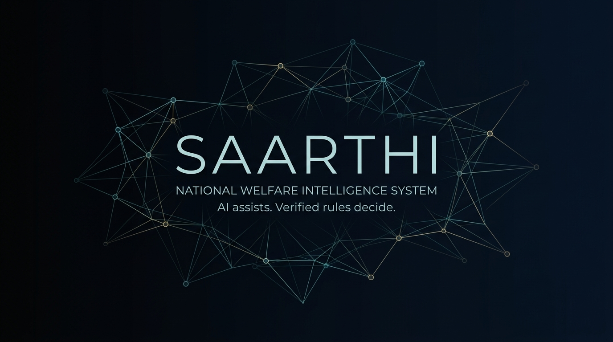
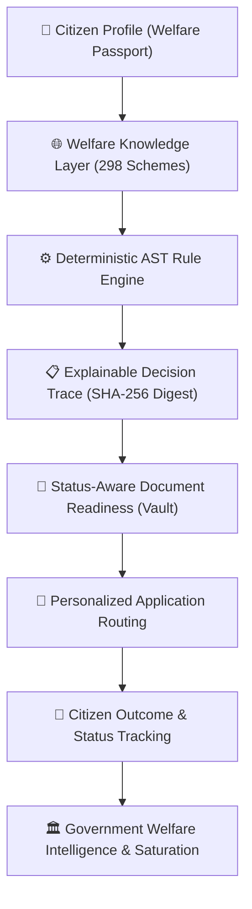
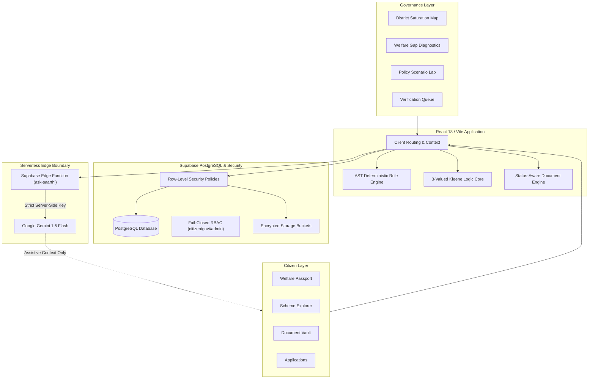

<p align="center">
  
</p>

<h1 align="center">SAARTHI</h1>

<p align="center">
  <strong>National Welfare Intelligence System</strong><br>
  <em>"From welfare discovery to explainable eligibility to real action."</em>
</p>

<p align="center">
  Saarthi is a welfare intelligence platform designed to connect citizen profiles, welfare schemes, deterministic eligibility rules, document readiness, applications, and government-side welfare intelligence through a unified architecture.
</p>

<p align="center">
  <a href="https://saarthi-welfare-intelligence.vercel.app"><strong>🚀 Live Demo</strong></a> •
  <a href="docs/architecture.md"><strong>📚 Documentation</strong></a> •
  <a href="#system-architecture"><strong>🏗️ Architecture</strong></a> •
  <a href="docs/research.md"><strong>🧠 Research</strong></a> •
  <a href="https://github.com/404Vardan/saarthi-welfare-intelligence"><strong>💻 GitHub</strong></a>
</p>

<p align="center">
  
  
  
  
  
  
  
</p>

---

## 📌 Project Snapshot

| Metric / Dimension | Verified Value | Scope & Verification Grounding |
| :--- | :---: | :--- |
| **Canonical Scheme Records** | **298** | Central and State schemes encoded with structured metadata & criteria |
| **Core Regression Assertions** | **91** | AST operators, 3-valued Kleene logic, household graph & RLS tests passing |
| **Campus Pilot Schemes** | **30** | Targeted welfare schemes for students, scholars, and campus staff |
| **Campus Pilot Assertions** | **120** | 30 schemes evaluated across 4 deterministic integrity dimensions |
| **Supported Languages** | **11** | Multilingual UI (English, Hindi, Telugu, Tamil, Kannada, Marathi, etc.) |
| **Decision Traceability** | **SHA-256** | Byte-for-byte immutable decision reference IDs (`DEC-<SCHEME>-<HASH>`) |

> **Note on Verification**: Automated test suites validate software implementation behavior against repository-encoded rules. They demonstrate mathematical reproducibility and logic integrity, but do not represent independent statutory or legal certification by government bodies.

---

## 💡 Why Saarthi?

### The Problem
Public welfare in India represents significant budgetary allocations across central and state ministries. However, statutory welfare delivery suffers from severe information friction:

1. **Fragmentation**: Rules and guidelines are scattered across hundreds of departmental portals, gazette notifications, and government circulars.
2. **Ambiguous Criteria**: Statutory clauses use complex bureaucratic legalese involving layered conditions (caste categories, land ceilings, income slabs, age thresholds). Citizens cannot easily determine if they qualify or why they were disqualified.
3. **The "Missing-Data" Trap**: Most search portals fail silently or miscalculate when an applicant leaves an income or landholding field blank—either defaulting the value to ₹0 (granting an undeserved pass) or falsely rejecting the user.
4. **Document Friction**: Citizens often apply without knowing whether their certificates are valid, unexpired, or issued by the required competent authority.
5. **Administrative Blindspots**: Policymakers lack real-time telemetry explaining why eligible citizens drop out across the application lifecycle.

---

### The Saarthi Approach

Saarthi structures welfare policies into computable knowledge representations evaluated via a transparent, multi-step pipeline:



---

## ⚖️ AI Assists. Verified Rules Decide.

The foundational design principle of Saarthi is that **Generative AI must never serve as the authoritative decision-maker for welfare eligibility**.

Entitlements affect real human lives, food security, healthcare, and education. Probabilistic Large Language Models (LLMs) hallucinate, drift, lack reproducibility, and are vulnerable to prompt manipulation.

```
                    SAARTHI TRUST MODEL

        ┌──────────────────────────────────────────────┐
        │         DETERMINISTIC RULE ENGINE            │
        │                                              │
        │  • Eligibility decisions                     │
        │  • AST predicate evaluation                  │
        │  • 3-Valued Kleene logic                     │
        │  • Decision trace generation                 │
        │  • Cryptographic SHA-256 decision digest     │
        │  • Statutory rule versioning (rule_version)  │
        │  • Explicit missing-data detection           │
        └──────────────────────┬───────────────────────┘
                               │
                               ▼
                        AUTHORITATIVE
                      ELIGIBILITY RESULT


        ┌──────────────────────────────────────────────┐
        │            ASSISTIVE GEMINI AI               │
        │                                              │
        │  • Natural-language interaction              │
        │  • Plain-language clause explanation         │
        │  • Conversational onboarding guidance        │
        │  • Document application checklist assistance │
        │  • Multilingual translation assistance       │
        └──────────────────────────────────────────────┘

        AI DOES NOT BECOME THE AUTHORITY FOR ELIGIBILITY.
```

### Comparing Architectural Roles

| Dimension | Deterministic AST Engine (`eligibilityEngine.js`) | Generative Large Language Models (Gemini) |
| :--- | :--- | :--- |
| **System Role** | **Authoritative Decider** | **Assistive & Conversational Interface** |
| **Execution** | Boolean AST predicate evaluation on normalized attributes | Natural-language query translation and assistance |
| **Reproducibility** | 100% reproducible byte-for-byte SHA-256 digests | Probabilistic; subject to temperature and drift |
| **Missing Data** | 3-valued Kleene logic (`passed`, `failed`, `insufficient_data`) | Prone to hallucinations or default-zero assumptions |
| **Auditability** | Verifiable against exact statutory gazette clauses | Cannot cite statutory authority reliably without hallucinations |
| **Security** | Immune to prompt injection and jailbreaks | Bounded behind serverless edge proxy |

For a deep dive, see [docs/trust-model.md](docs/trust-model.md).

---

## 🏗️ System Architecture

Saarthi implements a dual-sided architecture serving both citizens and government administrators from a unified data and security foundation:



See the full technical specification in [docs/architecture.md](docs/architecture.md).

---

## 🌟 Product Showcase

### 1. Citizen Welfare Experience

<details open>
<summary><strong>Explore Citizen Features</strong></summary>

- **Adaptive Welfare Passport (`/passport`)**: Dynamic demographic profile capturing age, caste category, occupation, annual income, landholding, and family graph members.
- **Scheme Explorer (`/explore`)**: Comprehensive catalog of 298 central and state programs with real-time text search, state filtering, and sector tags.
- **Explainable Decision Trace (`/scheme/:id`)**: Step-by-step breakdown of every statutory clause evaluated. Shows why an applicant passed, failed, or requires additional documentation.
- **Near-Miss Tolerance Detection**: Identifies schemes where an applicant is within a reasonable tolerance delta (e.g., income marginally above ceiling).
- **Status-Aware Document Vault (`/documents`)**: Tracks required statutory certificates across six lifecycle stages (`VERIFIED`, `UNDER_REVIEW`, `UPLOADED`, `EXPIRED`, `REJECTED`, `NOT_UPLOADED`).
- **Application Lifecycle (`/applications`)**: Outbound routing to official government portals with reference code generation.
- **Ask Saarthi (`/ask-saarthi`)**: AI-assisted conversational interface powered by Gemini 1.5 Flash via serverless edge proxy.

</details>

### 2. Government Welfare Intelligence Console

<details open>
<summary><strong>Explore Administrative Intelligence Features</strong></summary>

- **Executive Analytics (`/operations/analytics`)**: Aggregate macro metrics, application throughput, and system health.
- **District Delivery Saturation (`/operations/districts`)**: Geospatial saturation curves across sample districts powered by a deterministic synthetic population model (`SyntheticPopulationAPI`).
- **Welfare Gap Analysis (`/operations/gaps`)**: Diagnostic breakdown identifying primary rejection causes and document bottlenecks across schemes.
- **Policy Lab & Scenario Simulation (`/operations/policy-lab`)**: What-if policy modeling allowing administrators to simulate demographic and budgetary impacts of altering eligibility thresholds.
- **Integrity Telemetry (`/operations/reports`)**: Verification queue auditing and evaluation reproducibility checks.

</details>

---

## 🔬 Eligibility Decision Science

Saarthi’s engine evaluates statutory rules using recursive Abstract Syntax Trees (ASTs) operating on **3-Valued Kleene Logic**:

### The 3 Evaluation States:
1. **`passed`**: Attribute satisfies statutory criteria.
2. **`failed`**: Attribute violates statutory criteria (hard disqualifier).
3. **`insufficient_data`**: Required attribute is missing from the profile.

```
Kleene Logic Invariants:
• passed   AND passed            = passed
• failed   AND any               = failed (short-circuit reject)
• passed   AND insufficient_data = insufficient_data
• failed   OR  insufficient_data = insufficient_data
• passed   OR  any               = passed (short-circuit pass)
```

Missing fields **never** default to false or ₹0 income. This eliminates the risk of false positives or premature rejections.

Read the complete mathematical specification in [docs/eligibility-engine.md](docs/eligibility-engine.md).

---

## 🧪 Testing & Verification Infrastructure

Saarthi maintains an extensive automated regression testing suite:

### 1. Core Deterministic Engine Suite (91 Assertions)
```bash
npm test
```
- **AST Predicate Operators**: 14 tests verifying `EQ`, `NEQ`, `GT`, `GTE`, `LT`, `LTE`, `IN`, `NOT_IN`, `CONTAINS`, `BETWEEN`.
- **3-Valued Logic & Null Safety**: 7 tests confirming short-circuiting and missing attribute safety.
- **Household Graph & Income Aggregation**: 2 tests validating family income summation across household members.
- **Statutory Personas**: 12 tests evaluating 10 distinct citizen profiles (Marginal Farmer, SC Student, Senior BPL, Artisan, Street Vendor, Pregnant Mother, etc.).
- **Status-Aware Document Readiness**: 12 tests confirming weighted readiness scoring.
- **Application Idempotency**: 4 tests preventing duplicate applications.
- **Auth Fail-Closed Integrity**: 10 tests verifying unauthenticated redirects and missing-role denial.
- **Cross-User Database & RLS Invariants**: 17 tests validating PostgreSQL RLS policies, trigger self-elevation blocks, and storage folder isolation.
- **Decision Hash Determinism & Zero Income**: 13 tests ensuring SHA-256 byte-for-byte reproducibility and ₹0 income handling.

### 2. Campus Welfare Pilot Coverage Suite (120 Assertions)
```bash
node --env-file=.env scripts/test_campus_coverage.js
```
Audits 30 targeted campus welfare schemes across **4 deterministic integrity dimensions**:
1. **Valid Persona**: Confirms statutory qualification (100% match).
2. **Ineligible Persona**: Confirms expected deterministic rejection on boundary conditions.
3. **Incomplete Persona**: Confirms safe return of `insufficient_data` without false rejections.
4. **Already-Receiving Flag**: Confirms duplicate enrollment exclusion.

Full testing runbook: [docs/testing.md](docs/testing.md).

---

## 💻 Technology Stack

| Layer | Technologies & Tools | Implementation Details |
| :--- | :--- | :--- |
| **Frontend Core** | React 18, Vite 6, JavaScript (ESM) | Responsive SPA, fast HMR bundling |
| **Routing & UI** | React Router DOM 6, Lucide Icons | Client-side routing, modular design tokens |
| **Styling** | Vanilla CSS Design Tokens | High-contrast, responsive, dark-mode optimized |
| **Database & Auth** | Supabase (PostgreSQL 15+) | Relational tables, JWT auth, fail-closed RBAC |
| **Data Protection** | PostgreSQL Row-Level Security (RLS) | Multi-tenant isolation, anti-escalation DB triggers |
| **Document Storage** | Supabase Storage | Encrypted private storage buckets with user folder partitioning |
| **Assistive AI** | Google Gemini 1.5 Flash via Edge Functions | Server-side proxy isolation; strict non-decider boundary |
| **Telemetry** | @vercel/analytics | Privacy-preserving web analytics |
| **Deployment** | Vercel | Production CDN hosting and edge routing |

---

## 🧠 Academic Research Direction

Saarthi serves as the reference implementation for ongoing academic research in civic technology and digital governance:

> **Formal Research Title:**  
> *"NWIS: A Knowledge Graph-Based National Welfare Intelligence System for Citizen-Centric Governance and Policy Decision Support"*

### Research Inquiries:
- **Ontological Representation**: Formalizing heterogenous state and central welfare policies into computable knowledge graphs.
- **Explainable Decision Science**: Developing auditable, deterministic reasoning under missing and uncertain citizen demographic inputs.
- **Administrative Friction Reduction**: Modeling status-aware document readiness to diagnose bureaucratic bottlenecks.
- **AI Trust Boundaries**: Establishing formal boundaries between probabilistic language models and deterministic statutory evaluation.

Detailed research overview: [docs/research.md](docs/research.md).

---

## 🗺️ Project Roadmap

- **Phase 1: Foundation (Completed)** — AST rule engine, 3-valued Kleene logic, initial schema, RBAC.
- **Phase 2: Citizen Experience (Completed)** — Adaptive Passport, Document Vault, 11-language UI, Gemini edge proxy.
- **Phase 3: Scheme Registry & Campus Pilot (Completed)** — 298 canonical schemes, 30 campus schemes, 91 core tests, 120 campus assertions.
- **Phase 4: Government Intelligence (In Progress)** — Synthetic population saturation mapping, welfare gap diagnostics, policy scenario lab.
- **Phase 5: Verification & Provenance (Planned)** — Gazette scraping pipelines, public provenance signing, community legal clinic verification.
- **Phase 6: Scaling & Inclusivity (Proposed)** — Multilingual voice interface for non-literate citizens, offline-first PWA mode for rural panchayats.

Explore our full roadmap in [docs/roadmap.md](docs/roadmap.md).

---

## 📚 Documentation Index

| Document | Description |
| :--- | :--- |
| [Architecture Specification](docs/architecture.md) | In-depth technical breakdown of platform layers, services, and data flows |
| [Eligibility Engine & Decision Science](docs/eligibility-engine.md) | AST operators, Kleene logic truth tables, and tolerance calculation |
| [Trust Model & AI Guardrails](docs/trust-model.md) | Clear boundaries between deterministic evaluation and assistive AI |
| [Scheme Registry Catalog](docs/scheme-registry.md) | Metadata schema, sector distribution, and verification status classifications |
| [Knowledge Graph Ontology](docs/knowledge-graph.md) | Entity relationships, household graph aggregation, and portfolio optimization |
| [Security & Access Control](docs/security.md) | RBAC design, PostgreSQL RLS policies, and storage bucket security |
| [Testing & Verification Guide](docs/testing.md) | Complete runbook for running 91 regression tests and 120 campus assertions |
| [Academic Research Framework](docs/research.md) | Formal research title, problem statement, and defense documentation |
| [Project Roadmap](docs/roadmap.md) | Completed milestones, active priorities, and proposed future phases |
| [Deployment Runbook](DEPLOYMENT.md) | Step-by-step instructions for Supabase SQL migrations and edge functions |
| [Accessibility Guidelines](ACCESSIBILITY.md) | Keyboard navigation, contrast, and assistive technology principles |

---

## 🤝 Contributing

We welcome contributions from software engineers, policy researchers, civic-tech enthusiasts, students, and accessibility advocates.

Please review our [Contributing Guidelines](CONTRIBUTING.md) and [Code of Conduct](CODE_OF_CONDUCT.md) before submitting a pull request.

> **Crucial Rule for Scheme/Rule Contributions:**
> Every submitted welfare scheme or eligibility rule change must include an **authoritative official government source** (`*.gov.in` portal, gazette notification, or official guideline). **No rules may be generated solely via LLM prompting.**

---

## 📖 Citation

If you use Saarthi or the NWIS framework in your academic research, GovTech studies, or policy evaluations, please cite this work as follows:

```bibtex
@software{Desai_Saarthi_NWIS_2026,
  author = {Desai, Vardan},
  title = {{NWIS: A Knowledge Graph-Based National Welfare Intelligence System for Citizen-Centric Governance and Policy Decision Support}},
  url = {https://github.com/404Vardan/saarthi-welfare-intelligence},
  version = {2.0.0},
  year = {2026}
}
```

See [CITATION.cff](CITATION.cff) for machine-readable citation metadata.

---

## 🛡️ Security & Responsible Disclosure

If you discover a security vulnerability or sensitive data exposure, please consult our [Security Policy](SECURITY.md).  
**Please do not report vulnerabilities via public GitHub issues.** Report them confidentially to `pinkudesai1301@gmail.com` or via [GitHub Security Advisories](https://github.com/404Vardan/saarthi-welfare-intelligence/security/advisories).

---

## 📄 License & Statutory Disclaimer

- **Software License**: The Saarthi codebase and architecture are licensed under the [MIT License](LICENSE).
- **Government Information**: Public welfare scheme details, guidelines, and gazette criteria are sourced from public domain materials published by the Government of India and respective State Government ministries.
- **Non-Affiliation**: Saarthi is an independent, open-source GovTech research project. It is **not** officially affiliated with, endorsed by, or operated by the Government of India or any state administration.

---

## 👥 Maintainer

- **Lead Author & Maintainer**: **Vardan Desai** ([@404Vardan](https://github.com/404Vardan))
- **Email**: `pinkudesai1301@gmail.com`
- **Repository**: [404Vardan/saarthi-welfare-intelligence](https://github.com/404Vardan/saarthi-welfare-intelligence)

---

## ⭐ If Saarthi is Useful to You

Try the [live demo](https://saarthi-welfare-intelligence.vercel.app), explore the [architecture](docs/architecture.md), open an [issue](https://github.com/404Vardan/saarthi-welfare-intelligence/issues) with feedback, or contribute an improvement!
