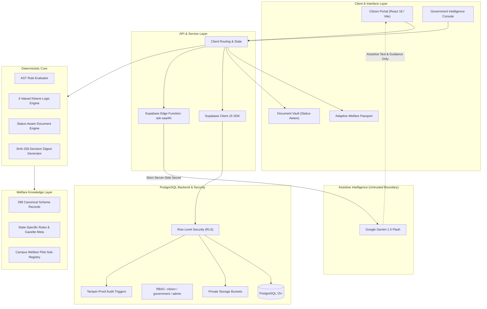

# Saarthi System Architecture

## Architectural Overview

The **National Welfare Intelligence System (NWIS)** is a dual-sided civic-tech platform connecting citizen-level welfare discovery, explainable eligibility, and document readiness with administrative policy intelligence and saturation telemetry.

---

## Architectural Subsystems

### 1. Dual-Sided Portals
- **Citizen Experience**: Allows citizens to maintain their demographic profile (Welfare Passport), discover eligible schemes, understand deterministic rule evaluations, assess document readiness, and track applications.
- **Government Welfare Intelligence Console**: Provides administrative telemetry, synthetic population district saturation mapping, welfare gap diagnostics (identifying primary rejection and document blockers), and policy threshold simulation.

### 2. Client Application (`React 18 + Vite`)
- Modern single-page application built on React 18, Vite 6, and Vanilla CSS design tokens.
- Client-side navigation powered by `react-router-dom`.
- Multilingual interface layer supporting 11 Indian languages with dynamic locale resolution.
- Responsive, accessible mobile-first interface optimized for varying network conditions.

### 3. Deterministic Eligibility Core (`src/engine/eligibilityEngine.js`)
- **Abstract Syntax Tree (AST)**: Evaluates statutory eligibility criteria through boolean and comparison predicates (`EQ`, `GT`, `LTE`, `IN`, `BETWEEN`, `AND`, `OR`, `NOT`).
- **3-Valued Kleene Logic**: Differentiates between true conditions, false conditions, and missing inputs (`insufficient_data`). Missing fields never evaluate to false or zero by default.
- **Document Readiness Grading**: Evaluates verification states (`VERIFIED`, `UNDER_REVIEW`, `UPLOADED`, `EXPIRED`, `REJECTED`, `NOT_UPLOADED`).
- **Cryptographic Traceability**: Generates an immutable SHA-256 decision digest (`DEC-<SCHEME>-<HASH>`) linking citizen profile state, scheme rule version, and evaluation timestamp.

### 4. Welfare Knowledge Layer (`src/api/`)
- Encodes 298 canonical Central and State Government schemes across 12 sectors.
- Maintains provenance metadata: `source_url`, `source_title`, `rule_version`, `rule_effective_from`, and `unencoded_conditions`.
- Includes the 30-scheme **Campus Welfare Pilot** targeted at students, research fellows, and university contract workers.

### 5. Backend Platform & Security (`Supabase PostgreSQL + RLS`)
- **PostgreSQL Database**: Relational schema managing `profiles`, `documents`, `applications`, and `household_members`.
- **Row-Level Security (RLS)**: Enforces strict data isolation. Citizen accounts can only access their own records.
- **Fail-Closed RBAC**: System roles (`citizen`, `government`, `admin`) are strictly isolated; database triggers prevent self-elevation.
- **Private Storage**: Encrypted document storage buckets partitioned by user ID.

### 6. Assistive AI Edge Proxy (`supabase/functions/ask-saarthi`)
- Powered by Google Gemini 1.5 Flash.
- Proxied through a secure Supabase Edge Function where API credentials remain server-side.
- Strictly bounded: Generative AI provides conversational clarity, plain-language translations, and guidance. It does **not** make eligibility decisions.
