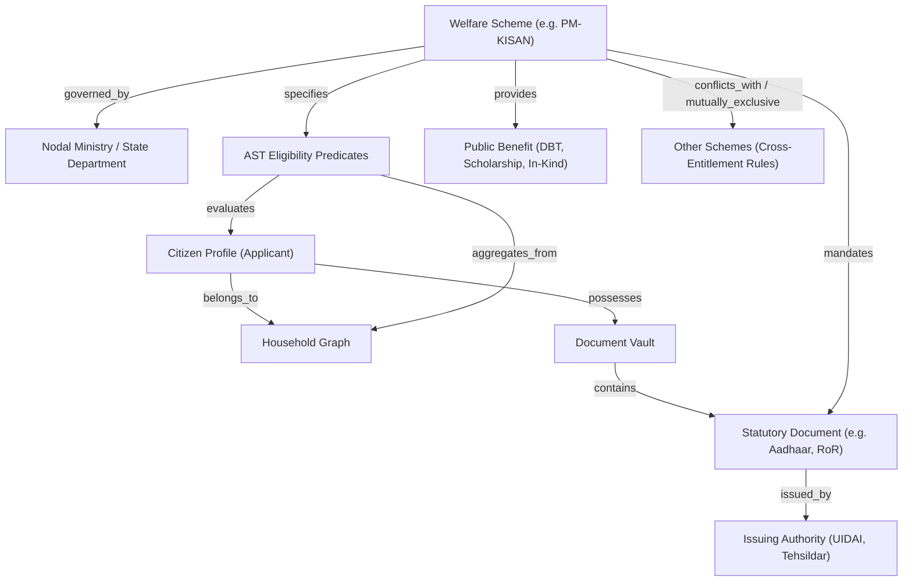

# Saarthi Welfare Knowledge Graph Architecture

## Conceptual Model

The **National Welfare Intelligence System (NWIS)** models India's fragmented public welfare ecosystem as a multi-relational Knowledge Graph. Rather than treating schemes as isolated text entries, the knowledge graph models relationships between citizens, household graphs, demographic attributes, statutory criteria, documents, and issuing authorities.

---

## Core Entities & Schema Ontology

### 1. Citizen & Household Node
- **Attributes**: `age`, `gender`, `caste_category`, `occupation`, `state`, `district`, `annual_income`, `is_differently_abled`, `marital_status`.
- **Household Edge**: Connects individual citizens to `household_members` (spouse, children, dependent parents).
- **Graph Aggregation**: The engine aggregates household-level attributes dynamically. For example, `household.aggregate_income` recursively sums the income of the head and all declared members to prevent circumvention of family income thresholds.

### 2. Scheme Node
- **Attributes**: `scheme_id`, `name`, `nodal_ministry`, `state`, `benefit_type`, `benefit_amount`, `rule_version`.
- **Connections**:
  - `requires_predicate`: Edges to AST condition nodes.
  - `mandates_document`: Edges to required statutory proofs.
  - `supervised_by`: Edges to government administrative bodies.

### 3. Statutory Document Node
- **Attributes**: `doc_id`, `name`, `issuing_authority`, `validity_period_months`, `verification_mode`.
- Documents connect citizens to schemes. If a citizen holds a verified `Income Certificate` issued within the validity window, the document satisfaction edge is active for all schemes requiring that proof.

### 4. Cross-Scheme Relations & Portfolio Optimization
Welfare schemes often have mutual exclusion rules (e.g., beneficiaries receiving an old-age pension under a state scheme cannot concurrently draw a central IGNOAPS pension).
- Saarthi's knowledge layer models these as conflict or cross-exclusion edges (`mutually_exclusive_with`).
- The **Household Portfolio Optimizer** (`EligibilityEngine.evaluateHouseholdPortfolio`) maps all eligible schemes across family members, deduplicates entitlements, and computes an optimal benefit portfolio sorted by accessibility and document readiness.
